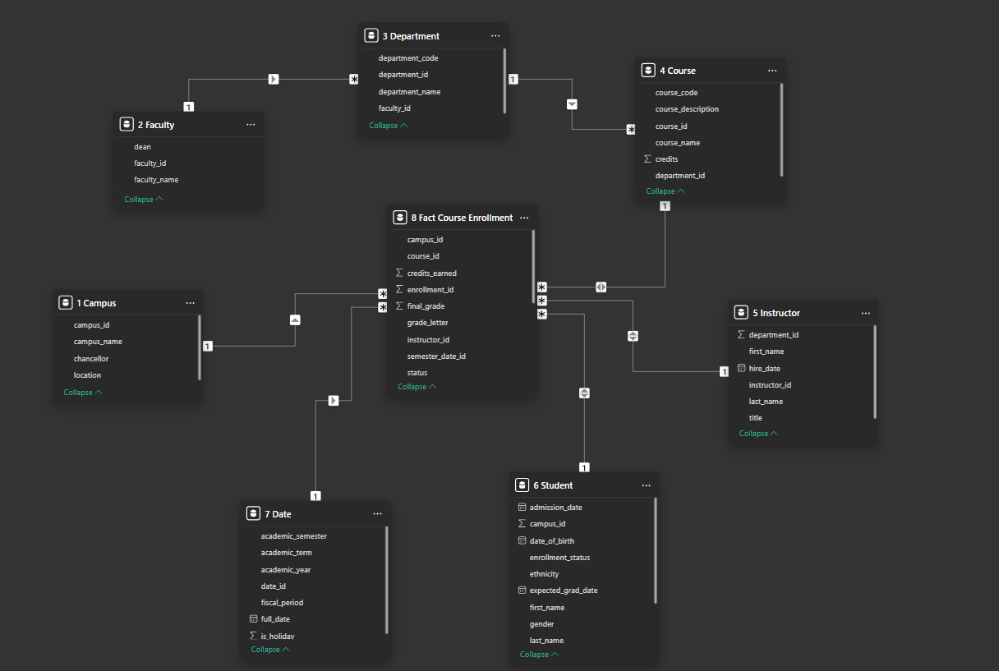
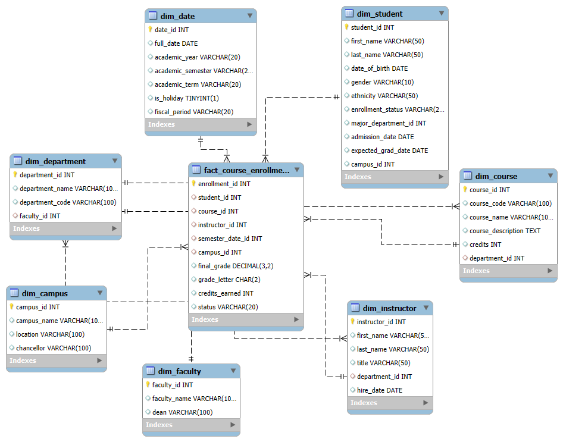
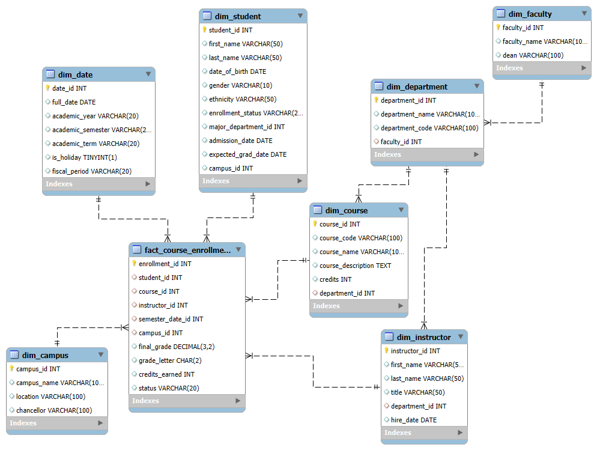
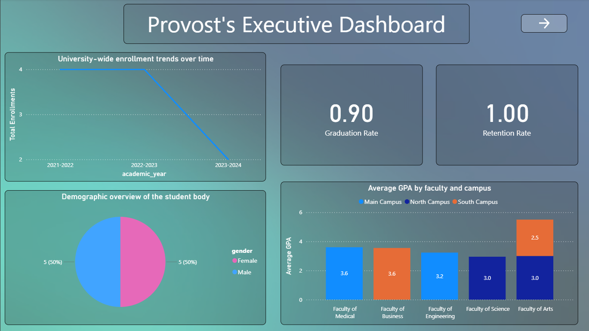
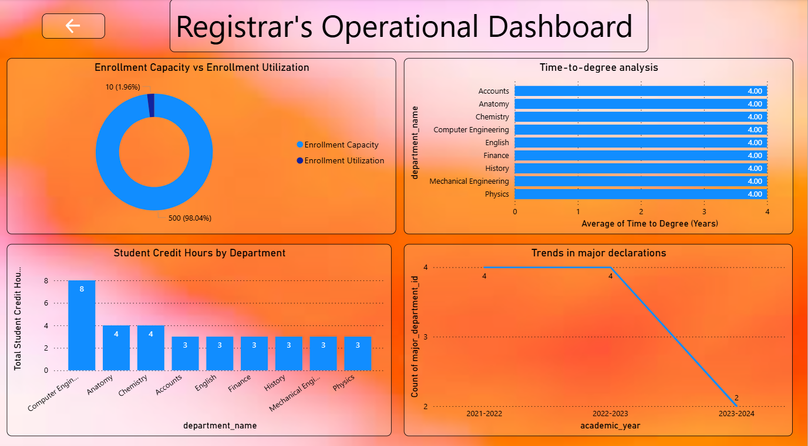
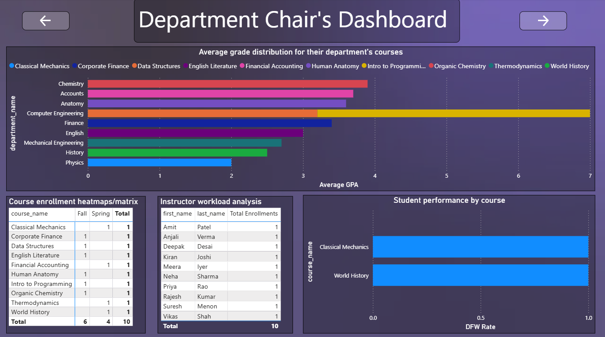
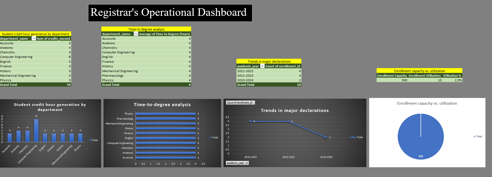
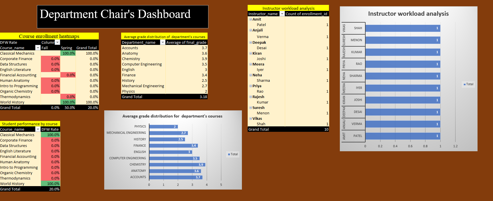

# 🎓 Prestige University Performance Analysis Dashboard

A comprehensive **Business Intelligence** project developed using **Power BI, MySQL, Microsoft Excel, Tableau, and Data Warehousing** to analyze university-wide academic performance, student enrollment, departmental outcomes, and operational metrics.

The project transforms normalized educational data into meaningful insights through interactive dashboards designed for different university stakeholders.

---

# 📖 Project Overview

Universities generate large volumes of academic and administrative data every semester. This project integrates data from multiple sources into a centralized analytical solution using Data Warehousing concepts and Business Intelligence tools.

The solution consists of **three role-based dashboards**, each designed to support decision-making at different management levels:

- 🎯 Provost (Executive Dashboard)
- 🏫 Registrar (Operational Dashboard)
- 👨‍🏫 Department Chair (Department Dashboard)

The project demonstrates the complete BI lifecycle from data collection to dashboard visualization.

---

# 🎯 Objectives

- Analyze university-wide academic performance.
- Monitor enrollment trends.
- Measure graduation and retention rates.
- Compare department-wise academic performance.
- Analyze instructor workload.
- Track student credit hours.
- Monitor course enrollment.
- Support strategic and operational decision-making using data.

---

# 🛠 Tech Stack

| Technology | Purpose |
|------------|---------|
| MySQL | Database creation, SQL queries, and analysis |
| Microsoft Excel | Data cleaning, validation, and preprocessing |
| Power BI | Interactive dashboard development |
| Tableau | Dashboard visualization |
| Data Warehousing | Star Schema & Snowflake Schema |
| SQL | Data extraction and transformation |

---

# 🏗 Business Intelligence Workflow

```
CSV Files
      │
      ▼
Microsoft Excel
(Data Cleaning & Validation)
      │
      ▼
MySQL Database
(SQL Queries)
      │
      ▼
Data Warehouse
(Star & Snowflake Schema)
      │
      ▼
Power BI / Tableau
(Interactive Dashboards)
      │
      ▼
Business Insights
```

---

# 📂 Project Structure

```text
Prestige-University-Performance-Analysis/
│
├── Background Images/
│   ├── Background 1.png
│   ├── Background 2.png
│   ├── Background 3.png
│   └── Background 4.png
│
├── Data/
│   ├── 1 Campus.csv
│   ├── 2 Faculty.csv
│   ├── 3 Department.csv
│   ├── 4 Course.csv
│   ├── 5 Instructor.csv
│   ├── 6 Student.csv
│   ├── 7 Date.csv
│   └── 8 Fact Course Enrollment.csv
│
├── Documentation/
│   ├── University Performance Data Warehousing.pdf
│   └── University-Performance-Data-Warehousing.pptx
│
├── Excel/
│   ├── Flat Schema.csv
│   └── Prestige University Performance.xlsx
│
├── Images/
│   ├── department-chair-dashboard.png
│   ├── provost-dashboard.png
│   ├── registrar-dashboard.png
│   ├── Excel Department Chair Dashboard.png
│   ├── Excel Provost Dashboard.png
│   ├── Excel Registrar Dashboard.png
│   ├── ER Diagram.png
│   ├── Star Schema.png
│   ├── Snowflake Schema.png
│   └── Flat Schema(Table).png
│
├── Power BI/
│   └── Prestige University Performance.pbix
│
├── SQL/
│   ├── Prestige University Performance.sql
│   └── Schemas.mwb
│
├── Tableau/
│   └── Prestige University Performance.twb
│
└── README.md
```

---

# 🗄 Data Warehouse Model

The project is built using a dimensional data warehouse model.

### Dimension Tables

- Campus
- Faculty
- Department
- Course
- Instructor
- Student
- Date

### Fact Table

- Fact Course Enrollment

The data warehouse follows both **Star Schema** and **Snowflake Schema** designs to optimize analytical queries and reporting.

---

# 📐 Database Design

## Entity Relationship Diagram



---

## Star Schema



---

## Snowflake Schema



---

# 📊 Dashboard 1 – Provost's Executive Dashboard

Designed for senior university leadership to monitor institution-wide performance.

### Key KPIs

- Graduation Rate
- Retention Rate
- University Enrollment Trends
- Student Demographics
- Faculty-wise Average GPA
- Campus Performance

### Business Value

Provides executives with a high-level overview of academic performance, enabling strategic planning and policy decisions.

---

# 📊 Dashboard 2 – Registrar's Operational Dashboard

Focused on academic operations and enrollment management.

### Key KPIs

- Enrollment Capacity vs Utilization
- Average Time to Degree
- Student Credit Hours
- Major Declaration Trends

### Business Value

Helps the registrar optimize enrollment, monitor academic progression, and improve operational efficiency.

---

# 📊 Dashboard 3 – Department Chair Dashboard

Provides department-level academic insights.

### Key KPIs

- Average GPA by Department
- Course Enrollment Matrix
- Instructor Workload
- Student Performance by Course
- DFW (Drop, Fail & Withdraw) Rate

### Business Value

Supports department heads in monitoring student outcomes, faculty workload, and course performance.

---

# 📈 Key Insights

- Overall Graduation Rate: **90%**
- Retention Rate: **100%**
- Engineering faculty achieved one of the highest average GPAs.
- Computer Engineering recorded the highest student credit hours.
- Enrollment trends indicate changes across academic years.
- Department-level GPA comparisons highlight differences in academic performance.
- Instructor workload is evenly distributed across departments.

---

# 📷 Power BI Dashboard Preview

## Provost's Executive Dashboard



Provides university-wide KPIs including Graduation Rate, Retention Rate, Enrollment Trends, Student Demographics, and Faculty Performance.

---

## Registrar's Operational Dashboard



Displays enrollment utilization, student credit hours, time-to-degree analysis, and major declaration trends.

---

## Department Chair Dashboard



Analyzes departmental GPA, instructor workload, DFW rate, and student performance by course.

---

# 📊 Excel Dashboard Preview

## Provost Dashboard


---

## Registrar Dashboard



---

## Department Chair Dashboard



---

# 🌟 Repository Highlights

- End-to-End Business Intelligence Project
- SQL Database Design
- Data Warehousing
- Star Schema
- Snowflake Schema
- ER Diagram
- Power BI Dashboard
- Tableau Dashboard
- Excel Dashboard
- Interactive KPI Reporting
- Business Intelligence Analytics

---

# 💼 Skills Demonstrated

- SQL Query Writing
- Database Design
- Data Cleaning
- Data Validation
- Data Modeling
- Star Schema Design
- Snowflake Schema Design
- Data Warehousing
- Power BI Dashboard Development
- Tableau Visualization
- KPI Design
- Business Intelligence
- Data Analysis
- Interactive Reporting

---

# 🚀 How to Run

1. Clone this repository.
2. Import the SQL script into MySQL Workbench.
3. Explore the normalized CSV datasets inside the **Data** folder.
4. Review the cleaned dataset available in the **Excel** folder.
5. Open the Power BI (`.pbix`) file.
6. Refresh the data model if required.
7. Explore the dashboards using filters and slicers.

---

# 🔮 Future Enhancements

- Implement Row-Level Security (RLS)
- Connect to a live database
- Automate ETL process
- Deploy dashboards using Power BI Service
- Integrate predictive analytics for student performance
- Add real-time reporting capabilities

---

# 👨‍💻 Author

## Shreeganesh Taralekar

**Aspiring Data Analyst**

### Skills

SQL • MySQL • Power BI • Microsoft Excel • Tableau • Data Warehousing

**GitHub**

https://github.com/ShreeganeshTaralekar

**LinkedIn**

https://www.linkedin.com/in/shreeganesh-taralekar/

---

# 📄 License

This project is intended for educational and portfolio purposes.

---

## ⭐ If you found this project useful, please consider giving it a star!